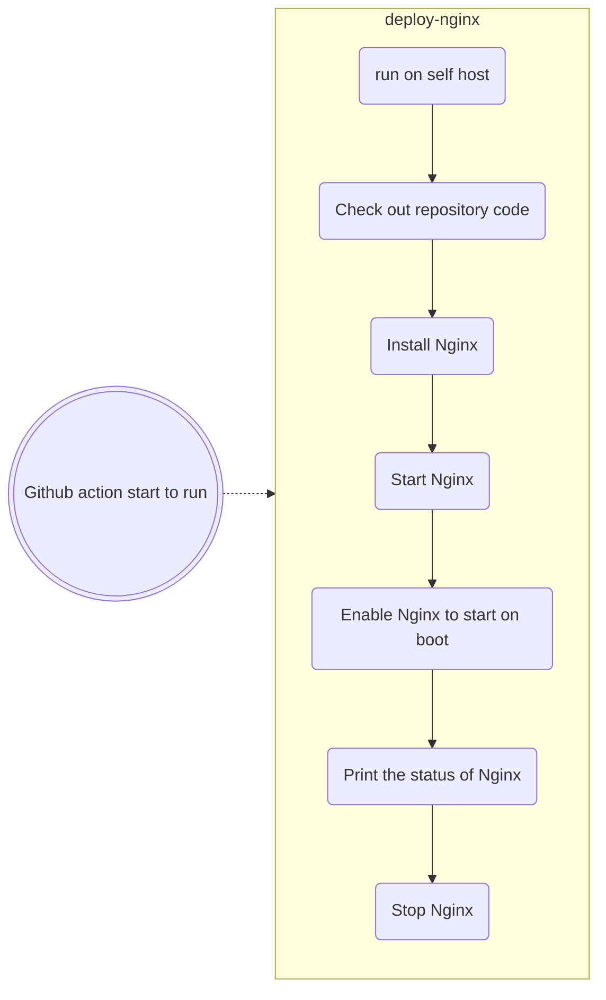

---

<p>
<h1> Hey Again &nbsp;&nbsp;&nbsp;Welcome To My "ci_cd_github_action_aws" &nbsp;=)</h1>
</p>
<br/>

## 💻 Languages and Tools:


---

# CI/CD GitHub Actions for AWS

This project uses GitHub Actions to deploy a web page on an AWS instance using NGINX.

## Table of Contents

1. [Introduction](#introduction)
2. [GitHub Actions Workflow](#github-actions-workflow)
3. [Self-Hosted Runner Setup](#self-hosted-runner-setup)
4. [Using the Self-Hosted Runner](#using-the-self-hosted-runner)
5. [Diagram](#diagram)

## Introduction

This repository demonstrates how to use GitHub Actions to connect to AWS and deploy a website on an EC2 instance using NGINX. The process involves setting up a self-hosted runner on your EC2 instance and running the GitHub Actions workflow to deploy the web page.

## GitHub Actions Workflow

The workflow file is located at `.github/workflows/AwsInstanceRunningJob.yml`.

### How It Works

This GitHub Action workflow will deploy a website on your AWS instance using NGINX.

## Self-Hosted Runner Setup

### Steps

1. **Prepare Your AWS Instance**:
   - If you already have an instance, copy its IP address. If not, create a new instance and copy its IP address.

2. **Configure the Self-Hosted Runner**:
   - In your GitHub repository, navigate to **Settings** > **Actions** > **Runners**, and click **New self-hosted runner**.
   </br>
   

   
</br>
3. **Choose the OS**:
</br>

   
</br>
4. **Run the Following Commands on Your Instance**:

## Using the Self-Hosted Runner
## Download

```bash

# Create a folder
$ mkdir actions-runner && cd actions-runner
# Download the latest runner package
$ curl -o actions-runner-osx-x64-2.316.1.tar.gz -L https://github.com/actions/runner/releases/download/v2.316.1/actions-runner-osx-x64-2.316.1.tar.gz
# Optional: Validate the hash
$ echo "392b9d7b6d5b4d4f3814dbf874641b894f0c72447cdf05ce93158832d2d49b6b  actions-runner-osx-x64-2.316.1.tar.gz" | shasum -a 256 -c
# Extract the installer
$ tar xzf ./actions-runner-osx-x64-2.316.1.tar.gz
```

## Configure

```bash
# Create the runner and start the configuration experience
$ ./config.sh --url https://github.com/IftachZilcaPaz/ci_cd_github_action_aws --token BEENAKBJOTESLEFDCXXDBRTGKCFDC
# Last step, run it!
$ ./run.sh
```

## Using your self-hosted runner

```bash
# Use this YAML in your workflow file for each job
runs-on: self-hosted
```
<br/>
<br/>
<br/>

those lines will tell the script to run on the instance:


<br/>
<br/>
<br/>

## Diagram



